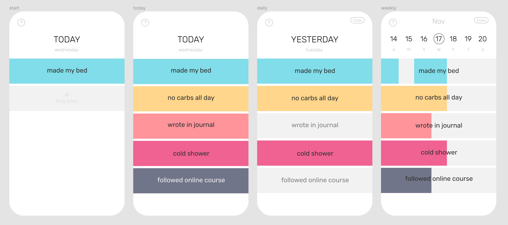

# VAAMOS

A Flutter app to help keep track of daily achievements.

## MVP

Features:

- **Add** new goals (maximum of 5 for now)
- **Delete** an **edit** goal
- **Mark** everyday goals as **complete** by just tapping
- **View** by **daily** or **weekly**

## Tasks

- general layout
  - [x] add input field
  - [x] on long press addGoalBox ==> change into input field

- Basic file system
  - [x] create test file for the array of goals "goals.json" (auto created when user first opens app)
  - [x] storage.json
  - [x] read function to get string of goals to display
  - [x] save input into storage
